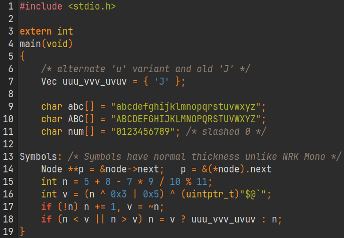

# Spray Minds Mono

This is a modified version of [JetBrains Mono][JBM] based on the current git master branch, and using modified scripts for NRK Mono to apply the changes automatically.

And yes, the name is wordplay for 'Jet' and 'Brains'.

- - -

***You can download the ttf files from the `SprayMindsMono.tar.zst` file in this repository.***

- - -

Changes compared to JetBrains Mono include:

* Slashed zero (`0` swapped with its `.zero` variant).
* `u` with a downwards bar (`u` and related characters swapped with their `.cv12` variants).
* Uses the alternate/old `5` (`5` and related characters swapped with their `.cv20` variants).
* Uses old `J` with a bar on top (copied from version 2.001).
* Modified `ascent/descent` to workaround the [line height issue][lineBug], copied from version 2.001 (this may cause problems with certain glyphs).
* Additional "Condensed" variant (-6%) available to better utilize horizontal
  screen space.

## License

Same as [JetBrains Mono][JBM].

## How to extract `.tar.zst`

#### Linux/BSD/macos

0. Install the `zstd` package (if you don't have it installed already).
1. Run `tar -I zstd -xf NRK-Mono.tar.zst`.

#### Windows

If you want a GUI then [7-zip-zstd](https://github.com/mcmilk/7-Zip-zstd)
(`.exe` download [here](https://github.com/mcmilk/7-Zip-zstd/releases)) seems to
be the recommended tool.

If you are comfortable with command-line, `zstd` provides official [builds for
windows](https://github.com/facebook/zstd/releases/) including a `zstd.exe`.

[JBM]: https://github.com/JetBrains/JetBrainsMono
[lineBug]: https://github.com/JetBrains/JetBrainsMono/issues/334
